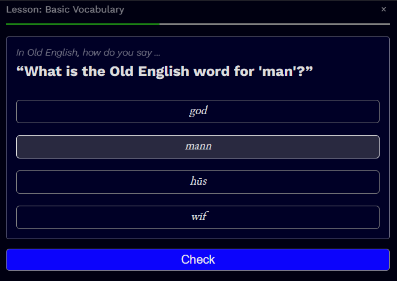
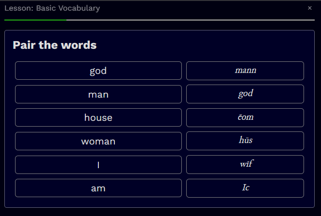
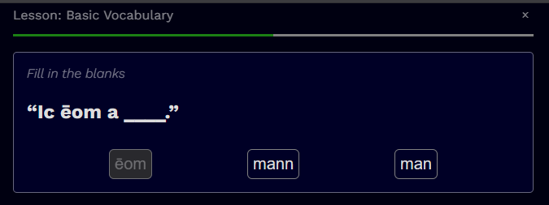
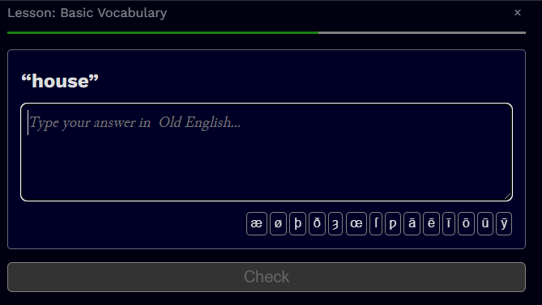

# Quiz Lessons: learn Old English or anything

Configurable quiz cards for language learning or other quizes. 

Create and share quizes and language lessons.

## Demo: Learn Old English

[https://leegee.github.io/learning-oe-solidjs/](https://leegee.github.io/learning-oe-solidjs/)

## Synopsis

    bun dev

## Features

* Purely client-side - "local first" 
* Easy to extend via DAO
* A SolidJS prototype without any third-party dependencies
* Several types of quiz lessons:
    1. multiple choice
    1. fill in the blanks
    1. match vocabulary
    1. translate a sentence
    1.  create a sentance from a list of words
* WYSIWYG editor, [JSON](lessons.json) format with [JSON Scheme](./lessons.schema.json)
* Fully supports JSON i18n - easy to create localisation and configuration in [JSON](app.config.json)
* Easy dev and builds with Vite and Typescript

## Card types

* *Multiple choice* 
* *Vocab" presents two columns of shuffled words which need to be paired.
* *Blanks* presents a sentence with blanks which need to be completed from a list of words
* *Writing Blocks* rqeuires the user to translate a sentence by selecting words
* *Writing* rqeuires the user to translate a sentence by entering free text
* *Dynamic Vocab* selects creates a Vocab lesson by combining data from other cards in he lesson

## Config Optins

...are undocumented except for:

`allowCustomisation` - set to true or only one course is available without a course editor.

`homeInsteadOfMenu` - instead of loading the menu, load the homepage.

## NB

Any resemblance to other language learning apps is purely coincidence. 

## TODO

* ? Restore use of incrementLessonsIdx and test for end of course. This may have been done.

## Thanks:

* The [Junicode Old English](https://github.com/psb1558/Junicode-font/releases/tag/v2.211) font.
* `SolidJS`, `@solid-primitives/storage`, `solid-js/store`
* Vite
